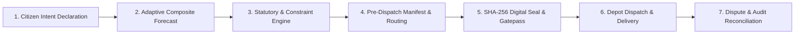
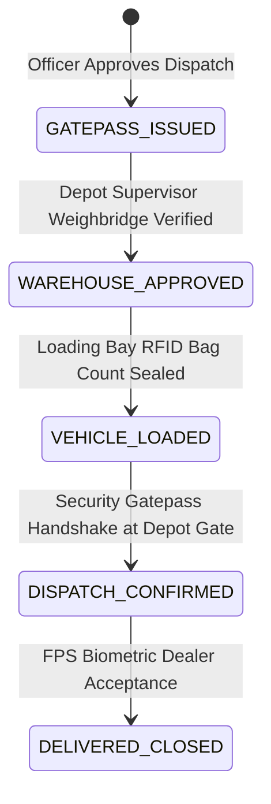
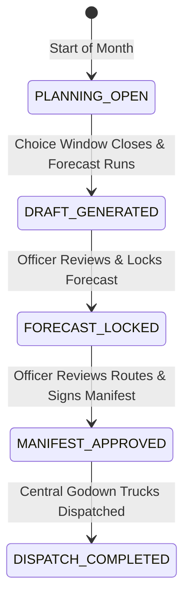
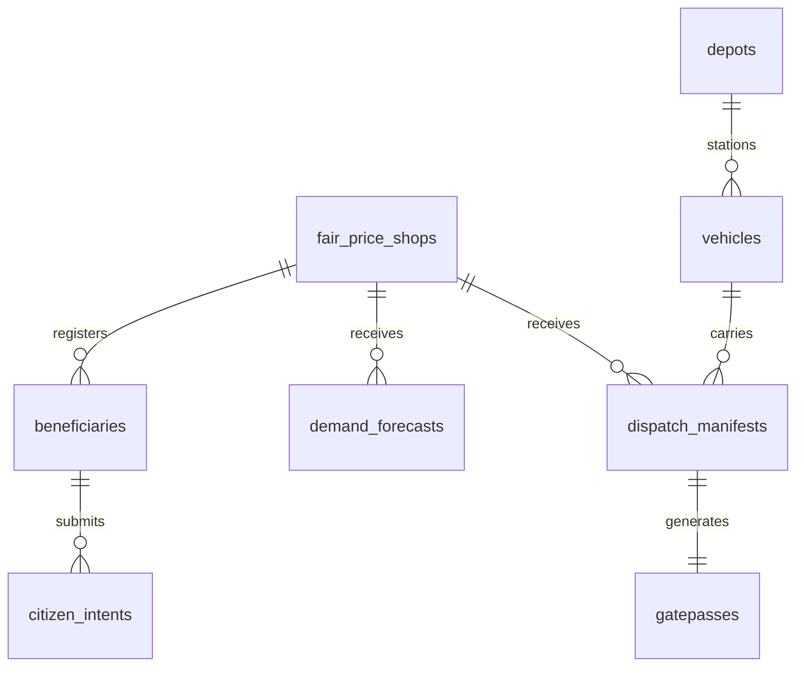

# PDS DemandSync — Functional Review & Technical Architecture Guide
**Govt. of Karnataka • Department of Food & Civil Supplies • Bengaluru Urban District Pilot**

---

## 1. System Overview & Core Problem Statement

### 1.1 The Fundamental Flaw of Traditional PDS Supply Allocation
The Indian Public Distribution System (PDS) is one of the world's largest food security networks, serving over 800 million citizens through approximately 540,000 Fair Price Shops (FPS). 

Historically, grain dispatch from Central Warehouses/FCI Godowns to Fair Price Shops has operated entirely on **static historical allocations** or **card-count quotas**:
$$\text{Static Dispatch} = \text{Registered Cards} \times \text{Per-Card Entitlement}$$

This static push-based model breaks down in rapidly growing urban and peri-urban environments due to:
1. **Unpredictable Intra-District Migration:** Under *One Nation One Ration Card* (ONORC), migrant workers frequently collect grain away from their home FPS (e.g., Peenya Industrial Corridor, Whitefield IT Corridor, Bellandur Ring Road).
2. **Seasonal & Festival Volatility:** Festival peaks (such as Ganesh Chaturthi or Deepavali) trigger sudden localized rice/wheat surges that historical moving averages fail to predict.
3. **Severe Supply-Demand Mismatch:** Certain outflow shops accumulate excess rotting grain stock (surplus holding >60% capacity), while inflow corridor shops experience sudden mid-cycle stockouts, forcing citizens to make multiple futile visits.
4. **Reactive & Costly Emergency Logistics:** Traditional logistics attempts to solve stockouts *after* trucks depart, incurring emergency re-routing, driver overtime, and supply delays.

### 1.2 The DemandSync Paradigm Shift
**PDS DemandSync** introduces a foundational paradigm shift:
> *"Don't reroute the truck after it leaves. Prepare the demand before it leaves."*

DemandSync transforms PDS from a rigid push system into a **hybrid intent-informed, statutory-bounded supply chain**:
- **Forward-Looking Citizen Signals:** Captures voluntary, non-coercive collection preferences 7–10 days before the monthly cycle starts.
- **Adaptive Demand Forecasting:** Combines historical consumption baseline with forward citizen signals and ONORC portability trends.
- **Pre-Dispatch Vehicle & Manifest Optimization:** Calculates the exact required replenishment payload ($Q^*$) per FPS and generates optimal TSP truck routes and digitally signed manifests **before the vehicle leaves the central depot**.
- **Ironclad Statutory Invariants:** Enforces that citizen entitlements are constitutionally guaranteed and cannot be cut, reduced, or compromised by any algorithmic model.

---

## 2. Citizen Portal & Intent Declaration Engine

### 2.1 3-Step Express Intent Flow
Citizens interact with a lightweight, multi-lingual web/mobile portal designed for high accessibility (Kannada, Hindi, Tamil, Telugu, English):
1. **Authentication & Entitlement Display:** Citizen logs in with pseudonymous beneficiary credentials (e.g., `BEN-KA-0001` / `RC-KA-BLR-0001`). The system instantly displays their statutory family entitlement (e.g., 20 kg Rice, 5 kg Wheat) and current cycle balance.
2. **Service Preference & FPS Selection:** Citizen selects:
   - **Collection Mode:** *Collect from Fair Price Shop* (₹0.00 Free) or *Assisted Home Delivery* (for senior citizens / persons with disabilities).
   - **Target FPS:** Default Home FPS (e.g., *Malleshwaram Seva Kendra*) or Any Active FPS across Bengaluru Urban for portable ONORC collection (e.g., *Bellandur Outer Ring Road*).
   - **Commodity Preference:** Rice Only, Wheat Only, or Both.
3. **Review & Digital Receipt Generation:** Citizen reviews the declaration with an explicit statutory non-repudiation notice and confirms. The system returns a cryptographically signed **Digital Preference Receipt** with a unique Intent Reference ID.

### 2.2 Statutory Quota Protection & Non-Coercive Intent
- **Voluntary Participation:** Expressing forward intent is entirely voluntary.
- **Default Baseline:** If a citizen does not declare intent within the monthly choice window, the forecasting engine automatically assumes the statutory baseline for that card ($100\%$ historical quota default). **No citizen is ever denied food or penalised for not using the app.**
- **Statutory Floor Invariant:** The citizen portal cannot modify, reduce, or forfeit the statutory entitlement under the National Food Security Act (NFSA).

### 2.3 Pseudonymization & Citizen Privacy
To prevent surveillance or profiling:
- Raw Aadhaar/Ration Card numbers are hashed using salt-derived SHA-256 tokens.
- The UI exposes only pseudonymous identifiers (`BEN-KA-0001` mapped to realistic citizen aliases like `Swathi Bhat`).
- Public dashboards and route manifests never expose citizen home addresses or personal identity records.

---

## 3. District Admin Analytics & Operations Dashboard

### 3.1 Operations Dashboard Architecture
The District Supply Officer dashboard provides real-time supply visibility across all 20 Fair Price Shops and 2 Central Depots (*Bengaluru Central FCI Godown Hebbal* and *Banaswadi PDS Buffer Storage Depot*):

| Dashboard Section | Core Capabilities |
| :--- | :--- |
| **KPI Metric Cards** | Active Cycle (`2026-09`), Registered Ration Cards (2,000), Active Fair Price Shops (20), Declared Intent (43,200 kg), Baseline Forecast (98,400 kg), Recommended Dispatch (82,150 kg), Fleet Capacity Utilization (89.2%). |
| **Pre-Dispatch Incidents** | Real-time alerts for pre-dispatch conditions: **Incident 1 (Festival Demand Surge)** and **Incident 2 (FPS Capacity Headroom Constraint)**. |
| **Risk Classification Matrix** | Real-time classification of shops into **HIGH**, **MEDIUM**, and **LOW** risk based on inventory buffer and projected intent influx. |
| **FPS Network Overview Table** | Shop-by-shop tabular breakdown: Registered Beneficiaries, Historical Baseline, Declared Intent, Current Inventory, Forecast Demand, Recommended Dispatch ($Q^*$), and Risk Status. |
| **Actionable Modals** | Direct launches for *Citizen Request Queue*, *Scarcity Reconciliation*, *Causal Trace Lineage*, *What-If Forecast Simulator*, and *Route Manifest Generator*. |

---

## 4. Demand Forecast Engine (Composite Forecasting)

### 4.1 The 3-Component Composite Formula
DemandSync forecasts monthly demand per FPS $f$ and commodity $c$ using a mathematically grounded weighted composite model:

$$\hat{D}_{f,c} = w_h \cdot H_{f,c} + w_i \cdot I_{f,c} + w_p \cdot P_{f,c}$$

Where:
- $H_{f,c}$: **Historical Demand Baseline** — 6-month exponentially smoothed moving average ($\alpha = 0.3$).
- $I_{f,c}$: **Aggregated Declared Intent** — Direct sum of citizen forward-looking intent submitted during the active window.
- $P_{f,c}$: **ONORC Portability & Inflow Projection** — Inflow/outflow velocity calculated from inter-depot mobility trends.
- Weights: $w_h = 0.50$ (Historical stability), $w_i = 0.35$ (Citizen intent responsiveness), $w_p = 0.15$ (Portability adjustment), satisfying $w_h + w_i + w_p = 1.0$.

### 4.2 Outlier Protection & Smoothing
To prevent artificial demand spikes:
$$\hat{D}_{f,c} = \text{clamp}\left(\hat{D}_{f,c},\; 0.60 \times H_{f,c},\; 1.40 \times H_{f,c}\right)$$
This ensures the forecasted demand never fluctuates beyond $\pm 40\%$ of historical capacity without explicit supervisor authorization.

---

## 5. Constraint Engine & Feasibility Validation

### 5.1 The 9 Statutory & Logistics Invariants
Before any dispatch recommendation is authorized, the engine validates 9 hard and soft constraints:

| ID | Constraint Name | Type | Mathematical Invariant / Rule |
| :---: | :--- | :---: | :--- |
| **C1** | **Statutory Floor Guarantee** | Hard | $Q^*_{f,c} + \text{Inv}_{f,c} \ge \text{StatutoryFloor}_{f,c}$ |
| **C2** | **FPS Physical Capacity Bound** | Hard | $Q^*_{f,c} + \text{Inv}_{f,c} \le \text{StorageCapacity}_f$ |
| **C3** | **Depot Stock Availability** | Hard | $\sum_{f} Q^*_{f,c} \le \text{AvailableDepotStock}_c$ |
| **C4** | **Vehicle Payload Capacity** | Hard | $\sum_{f \in \text{Route}_v} Q^*_{f} \le \text{MaxPayload}_v$ |
| **C5** | **Driver Operating Shift** | Hard | $\text{RouteDuration}_v \le 8.0\text{ hours}$ |
| **C6** | **Commodity Non-Negativity** | Hard | $Q^*_{f,c} \ge 0,\;\forall f, c$ |
| **C7** | **Minimum Drop Threshold** | Soft | If $Q^*_f > 0 \implies Q^*_f \ge 500\text{ kg}$ (prevents micro-trips) |
| **C8** | **Outflow Surplus Suppression** | Soft | If $\text{Inv}_f / \text{Cap}_f \ge 0.50 \implies Q^*_f = 0$ (avoids dumping) |
| **C9** | **Route Proximity Optimization** | Soft | Cluster shops within $\le 12\text{ km}$ corridor radius |

---

## 6. Dispatch Decision Engine (Pre-Dispatch Manifest Generator)

### 6.1 Recommended Dispatch Formula ($Q^*$)
The authoritative recommended dispatch quantity $Q^*_{f,c}$ for each FPS $f$ and commodity $c$ is computed as:

$$Q^*_{f,c} = \max\left(0,\; \hat{D}_{f,c} - \text{Inv}_{f,c} + \text{SafetyBuffer}_{f,c}\right)$$

Where:
- $\text{SafetyBuffer}_{f,c} = 0.10 \times \hat{D}_{f,c}$ (10% strategic safety buffer for unforeseen ONORC walk-ins).
- If $\text{Inv}_{f,c} \ge \hat{D}_{f,c} + \text{SafetyBuffer}_{f,c}$, then $Q^*_{f,c} = 0.0$ (Surplus node; no truck dispatch required).

### 6.2 Fleet Corridor Matching & Route Optimization
DemandSync solves the Multi-Stop Vehicle Routing Problem (VRP) using Nearest-Neighbor TSP with 2-Opt refinement:
- **Vehicle 1 (North-West Heavy Corridor):** `DEMO-KA-04-E-1021` (Eicher Pro 10 MT) $\to$ Malleshwaram, Rajajinagar, Peenya.
- **Vehicle 2 (East Corridor / IT Belt):** `DEMO-KA-04-E-1022` (Tata Ultra 10 MT) $\to$ Bellandur, Sarjapur, Mahadevapura, Whitefield.
- **Vehicle 3 (South Industrial Corridor):** `DEMO-KA-51-M-3419` (BharatBenz 10 MT) $\to$ Electronic City, Bommasandra, Kengeri.
- **Vehicle 4 (Central Urban / Heritage Cluster):** `DEMO-KA-01-F-7801` (Ashok Leyland 8 MT) $\to$ Jayanagar, Basavanagudi, Chickpet, Shivajinagar.

---

## 7. Manifest & Gatepass Engine (Digital Seal & Security Protocol)

### 7.1 SHA-256 Cryptographic Tamper-Evidence
When a dispatch plan is locked by the District Supply Officer, the Manifest Engine generates a deterministic **SHA-256 Digital Seal**:

$$\text{DigitalSeal} = \text{SHA256}\left(\text{CycleID} \parallel \text{TruckID} \parallel \text{DepotID} \parallel \sum \text{RiceKg} \parallel \sum \text{WheatKg} \parallel \text{OfficerToken} \parallel \text{Timestamp}\right)$$

Any unauthorized modification of grain quantities in transit or at the weighbridge immediately invalidates the hash.

### 7.2 The 5-State Gatepass Lifecycle

---

## 8. Scarcity & Deficit Reconciliation Engine

### 8.1 Proportional Fair-Share with Statutory Floors
When Central Depot inventory experiences a shortfall ($\text{AvailableStock} < \sum Q^*$), DemandSync activates the **Scarcity Reconciliation Engine**:
1. **Statutory Floor Protection:** Every FPS is unconditionally allocated its non-negotiable minimum survival floor ($\text{Floor}_{f,c} = 0.35 \times \hat{D}_{f,c}$).
2. **Deficit Weighting:** Remaining depot slack is distributed proportionally based on **Vulnerability Weight** and **Current Stockout Risk**:
   $$\text{Allocation}_{f,c} = \text{Floor}_{f,c} + \text{RemainingSlack} \times \left(\frac{w_{\text{risk}, f} \cdot (\hat{D}_{f,c} - \text{Floor}_{f,c})}{\sum_j w_{\text{risk}, j} \cdot (\hat{D}_{j,c} - \text{Floor}_{j,c})}\right)$$
3. **Mandatory Officer Sign-Off:** Algorithmic scarcity plans cannot be auto-executed. The District Supply Officer must review the cut distribution, enter a justification, and digitally sign the override.

---

## 9. Causal Trace Engine (End-to-End Pipeline Lineage)

### 9.1 Deterministic Lineage Verification
The Causal Trace Engine allows evaluators and auditors to click any Fair Price Shop and inspect how raw citizen actions propagate through the entire system:

| Stage | Name | Description | Output Data |
| :---: | :--- | :--- | :--- |
| **1** | **Citizen Intent Signals** | Ingested individual forward declarations. | $+150\text{ kg}$ declared intent. |
| **2** | **Composite Forecast** | $w_i \times 150\text{ kg}$ dynamically lifts $\hat{D}$. | $\Delta \hat{D} = +52.5\text{ kg}$ demand surge. |
| **3** | **Statutory Rules Audit** | 9 constraints verified; capacity headroom confirmed. | All 9 invariants PASS. |
| **4** | **Authoritative Dispatch** | Safety buffer factored; net required replenishment. | $\Delta Q^* = +57.75\text{ kg}$ dispatch increment. |
| **5** | **Fleet Routing (TSP)** | Payload reassigned to corridor carrier. | Vehicle payload updated; 2-Opt route verified. |
| **6** | **Pre-Dispatch Manifest** | Itemized bill of lading updated before departure. | Manifest bill updated. |
| **7** | **Digital Seal & Gatepass** | New cryptographic SHA-256 hash generated. | New Gatepass SHA-256 seal issued. |

### 9.2 Live Intent Injection Demonstration
Evaluators can click **"Inject Intent Shift (+150 kg)"** in the Causal Trace modal:
- **Statutory Quota Delta:** $+0.0\text{ kg}$ (**INVARIANT** — Citizen entitlement never changes).
- **Forecast Delta:** $+52.5\text{ kg}$ (Mathematically exact $0.35 \times 150\text{ kg}$).
- **Manifest Delta:** $+57.75\text{ kg}$ (Includes $10\%$ safety buffer).

---

## 10. Workflow State Machine & Governance Rules

### 10.1 The 5 Workflow States
The system strictly enforces sequential state progression for every monthly cycle:

### 10.2 Strict Role-Based Transition Controls
- `POST /api/admin/workflow/advance` validates state invariants.
- No officer can jump from `PLANNING_OPEN` directly to `MANIFEST_APPROVED` without executing forecast validation.
- All state transitions record actor identity, IP address, timestamp, and signature token into the `audit_logs` table.

---

## 11. Authentication, RBAC & Security Model

### 11.1 Role-Based Access Control (RBAC)
- **`CITIZEN` Role:** Authenticated via JWT bearer tokens. Restricted strictly to reading personal entitlements, submitting forward collection intents, and viewing personal receipts.
- **`ADMIN` Role (`DISTRICT_SUPPLY_OFFICER`):** Authenticated via admin JWT. Access to district-wide analytics, forecast generation, scarcity reconciliation, manifest signing, and audit logs.
- **`DEPOT_SUPERVISOR` Role:** Access to weighbridge verification and gatepass loading sign-offs.

### 11.2 Cryptographic Integrity
- Passwords hashed using bcrypt (12 rounds).
- JWT tokens signed using HMAC-SHA256 with 24-hour expiration.
- Manifest digital seals signed using SHA-256 cryptographic digests.

---

## 12. Audit Trail & Dispute Resolution

### 12.1 Immutable Audit Log
Every critical action is appended to the `audit_logs` table with an SHA-256 event hash:
- `CITIZEN_INTENT_SUBMITTED`
- `FORECAST_GENERATED`
- `DISPATCH_MANIFEST_LOCKED`
- `SCARCITY_PLAN_APPROVED`
- `GATEPASS_ISSUED`
- `GATEPASS_VERIFIED`

### 12.2 Citizen Delivery Dispute Queue
Citizens who encounter collection discrepancies at Fair Price Shops can raise dispute tickets. District Supply Officers review and resolve disputes directly through the dashboard interface.

---

## 13. Database Tables & Key Schema Entities

### Schema Summary:
1. `fair_price_shops`: 20 urban shops (capacity, GPS coordinates, historical profile, inventory).
2. `beneficiaries`: 2,000 synthetic citizens (pseudonymous ID, card type, registered FPS).
3. `citizen_intents`: Voluntary collection preferences (intended FPS, delivery mode, commodity).
4. `demand_forecasts`: Monthly forecasts per FPS and commodity ($\hat{D}$, confidence, risk level).
5. `dispatch_manifests`: Pre-dispatch allocations ($Q^*$, vehicle assignment, stop sequence).
6. `depots`: 2 Central FCI Godowns (Hebbal and Banaswadi).
7. `vehicles`: 4 heavy corridor haulers (10 MT and 8 MT).
8. `gatepasses`: Cryptographic gatepasses with 5-stage status and digital seal.
9. `scarcity_plans` & `scarcity_items`: Reconciled fair-share allocations under depot deficit.
10. `audit_logs`: Immutable security log.

---

## 14. API Summary Table

| Method | Endpoint | Description | Auth Level |
| :--- | :--- | :--- | :--- |
| `GET` | `/api/health` | System health, database connection, cycle metadata. | Public |
| `GET` | `/api/fps` | List all 20 Fair Price Shops with inventory and capacity. | Public |
| `POST` | `/api/auth/beneficiary-login` | Authenticate citizen and issue JWT token. | Public |
| `POST` | `/api/auth/admin-login` | Authenticate District Supply Officer and issue admin JWT. | Public |
| `GET` | `/api/beneficiary/{id}/entitlement` | Get citizen statutory quota and consumed balance. | Citizen / Admin |
| `POST` | `/api/intent` | Submit forward-looking collection intent preference. | Citizen |
| `GET` | `/api/admin/dashboard-summary` | Fetch district analytics, KPIs, and shop overview. | Admin |
| `POST` | `/api/admin/forecast/generate` | Trigger composite forecast for active cycle. | Admin |
| `POST` | `/api/admin/manifest/generate` | Generate optimal routes and pre-dispatch manifest. | Admin |
| `GET` | `/api/admin/gatepass/view/{truck_id}` | View gatepass with cryptographic SHA-256 seal. | Admin / Depot |
| `POST` | `/api/admin/gatepass/verify-weighbridge`| Verify tare/gross payload at central depot weighbridge. | Depot / Admin |
| `POST` | `/api/admin/scarcity/simulate-fair-share`| Run proportional fair-share scarcity allocation. | Admin |
| `POST` | `/api/admin/scarcity/approve-plan` | Officer digital sign-off on reconciled scarcity plan. | Admin |
| `GET` | `/api/admin/causal-trace/{fps_id}` | Inspect 7-stage deterministic causal pipeline lineage. | Admin |
| `POST` | `/api/admin/workflow/advance` | Advance workflow state machine to next phase. | Admin |

---

## 15. 7-to-10 Minute Hackathon Demo Walkthrough Script

### Stage 1: The Problem & The Big Idea (1.5 Minutes)
- **Script:** *"Judges, today in India's PDS, grain is pushed using static formulas. When migrants move or festival surges occur, shops stock out while trucks are already on the road. Our thesis is simple: **Don't reroute the truck after it leaves. Prepare the demand before it leaves.**"*
- **Action:** Open `DemoLoginScreen`. Show the clean *Govt. of Karnataka • Bengaluru Urban PDS Pilot* interface.

### Stage 2: The Citizen Experience (2 Minutes)
- **Script:** *"Let us sign in as **Swathi Bhat** (`BEN-KA-0001`), a resident citizen. Notice her statutory entitlement: 20 kg Rice, 5 kg Wheat. DemandSync is 100% voluntary. Swathi selects her preferred collection window and target FPS. When she confirms, she receives an immutable Digital Preference Receipt. Even if she never used the app, her statutory quota remains 100% protected."*
- **Action:** Select Swathi Bhat $\to$ Express Preference $\to$ Submit $\to$ View Digital Preference Receipt.

### Stage 3: District Supply Officer Dashboard & Live Incidents (2 Minutes)
- **Script:** *"Now let us switch to the **District Supply Officer — Bengaluru Urban** portal. Here we see our 20 Fair Price Shops across Bengaluru Urban. Notice the **Pre-Dispatch Operational Incidents Panel** at the top."*
- **Action:** Point out **Incident 1 (Ganesh Chaturthi Festival Surge at Malleshwaram)** and **Incident 2 (Storage Headroom Constraint at Thanisandra)**. Show how the officer is alerted *before* dispatch approval.

### Stage 4: Causal Trace & Mathematical Lineage (2 Minutes)
- **Script:** *"How did Swathi's click affect the truck? Let's open the **Causal Trace Engine**. Here are the 7 stages from citizen signal to forecast, constraint check, dispatch calculation, fleet routing, and SHA-256 seal. Watch as we inject a $+150\text{ kg}$ intent shift: the statutory entitlement remains invariant ($+0.0\text{ kg}$), the forecast adjusts by $+52.5\text{ kg}$, and the truck payload updates deterministically."*
- **Action:** Open Causal Trace Modal $\to$ Click "Inject Intent Shift (+150 kg)" $\to$ Highlight live delta calculation.

### Stage 5: Scarcity Reconciliation & Digital Seal Gatepass (1.5 Minutes)
- **Script:** *"What if Central FCI Godown has a grain shortage? The officer opens **Scarcity Reconciliation**. The engine enforces statutory survival floors for every shop, applies fair-share cuts, and requires officer digital signature. Finally, the Manifest Engine generates a tamper-evident SHA-256 Digital Gatepass ready for the Hebbal weighbridge."*
- **Action:** Open Scarcity Dialog $\to$ Simulate Fair Share $\to$ Open Gatepass $\to$ Show SHA-256 Digital Seal and weighbridge verification.
