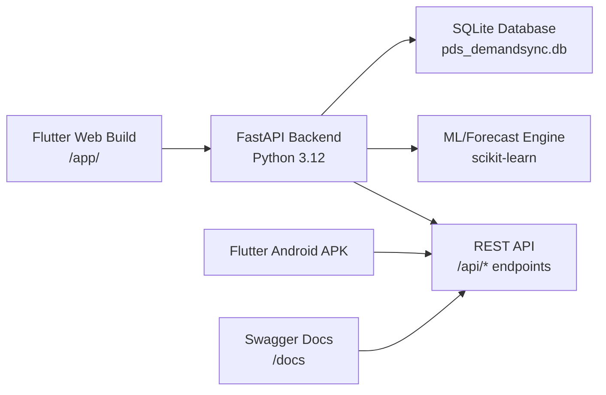
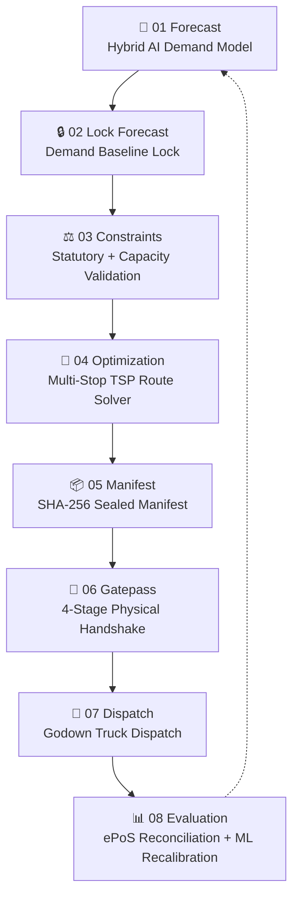
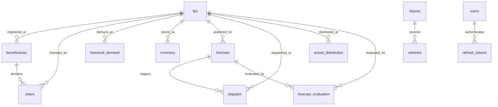
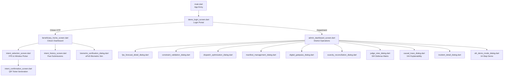

# PDS DemandSync — Complete Application Understanding

> **Live URL**: [https://sih-final-production-d29c.up.railway.app/app/](https://sih-final-production-d29c.up.railway.app/app/)
> **Project**: Smart India Hackathon (SIH) 2026 Prototype — Demo V1
> **Domain**: Public Distribution System (PDS) — Demand Forecasting & Supply Chain Management

---

## 1. What Is This App?

**PDS DemandSync** is an AI-powered decision-support platform for India's **Public Distribution System** (PDS). It tackles a critical problem: under the **One Nation One Ration Card (ONORC)** policy, 800+ million citizens can lift food grains from *any* Fair Price Shop (FPS) nationwide, but supply dispatch still relies on **static historical quotas**. This causes:

- 🔴 **Stockouts** in migrant-heavy urban hubs
- 🟡 **Excess inventory & spoilage** in source regions
- 🔴 **Mismatch** between where grain is sent vs. where it's actually needed

**PDS DemandSync solves this** by introducing a **lightweight, non-binding "intent signal"** — beneficiaries voluntarily declare *where* and *when* they plan to collect grain *before* the dispatch cycle. The system then combines this forward-looking signal with historical patterns, ML forecasting, and operational constraints to generate **precision pre-dispatch demand forecasts**.

> [!IMPORTANT]
> The intent signal is **purely a planning signal** — it does NOT modify entitlements, does NOT permanently lock an FPS, and does NOT replace ONORC. Citizens can still collect from any FPS regardless of declared intent.

---

## 2. Application Architecture

### 2.1 Tech Stack

| Layer | Technology | Purpose |
|---|---|---|
| **Frontend** | Flutter (Web + Android + Desktop) | Cross-platform responsive GovTech UI |
| **Backend** | Python 3.12 + FastAPI | High-performance asynchronous REST API |
| **Database** | SQLite 3 (WAL mode) | Lightweight self-contained relational storage |
| **Data Engine** | Pandas + NumPy | Aggregation, variance computation, analytics |
| **ML Engine** | scikit-learn | Multi-variate demand forecasting & calibration |
| **Visualization** | fl_chart + Custom Canvas | Heatmaps, trend lines, risk distributions |
| **Deployment** | Railway (Docker) | Production hosting with auto-deploy |
| **Auth** | HMAC-SHA256 JWT + OTP | Role-based cryptographic authentication |

### 2.2 Deployment Architecture



The backend serves the Flutter Web app as static files at `/app/` and exposes a comprehensive REST API under `/api/` with 40+ endpoints.

---

## 3. User Portals & Roles

The app serves **two primary user personas** with distinct portals:

### 3.1 Citizen / Beneficiary Portal

**Access**: Citizen OTP tab → Enter Ration Card ID (e.g., `BEN-KA-0001`) → OTP `123456`

````carousel

<!-- slide -->

<!-- slide -->

````

**Key Features**:
| Feature | Description |
|---|---|
| **OTP Login** | Phone-based OTP verification (simulated with preset ration cards) |
| **Ration Card Lookup** | Auto-retrieves beneficiary details (name, family, category like PHH/AAY) |
| **Statutory Quota View** | Shows entitled grain quantities (e.g., 5 kg/member → 16 kg Rice + 4 kg Wheat) |
| **FPS & Window Selection** | Choose preferred Fair Price Shop and collection date window (e.g., Day 21-24) |
| **Advance Demand Intent** | Declare planned lifting quantities — the core "intent signal" |
| **Digital Receipt & QR** | Generates booking confirmation with verifiable QR code |
| **Collection Mode** | FPS self-pickup vs. Doorstep Delivery with logistics fee |
| **Intent History** | View past submissions and their fulfillment status |
| **Multilingual UI** | English (`EN`), Hindi (`हिंदी`), Kannada (`ಕನ್ನಡ`) |

### 3.2 Department / Official Portal (District Supply Officer Dashboard)

**Access**: Department tab → Username: `admin_user` / Password: `admin_pass`

````carousel

<!-- slide -->

<!-- slide -->

````

**Key Features**:
| Feature | Description |
|---|---|
| **District Operations Dashboard** | Real-time monitoring for Bengaluru Urban district |
| **7-Stage Workflow Stepper** | Forecast → Validate → Allocate → Optimize → Dispatch → Verify → Evaluate |
| **Planning Cycle Engine** | Monthly cycle management (e.g., Cycle 7, 2026-09) with day simulation |
| **Aggregated Demand Metrics** | Historical baseline (118.5 MT), Intent demand (16.6 MT), AI Forecast (58.0 MT) |
| **Pre-Dispatch Incident Alerts** | Festival surges, storage constraints, stockout risks |
| **Interactive Analytics** | Historical vs. intent vs. forecast trends, portability shifts, inventory headroom |
| **FPS Overview Matrix** | Filterable table of all 20 FPS centers with action triggers |
| **FPS Detail Side-Drawer** | Deep telemetry, demand breakdown, risk assessment per shop |
| **Explainable AI (XAI)** | Causal trace & feature attribution for forecast decisions |
| **Officer Overrides** | DSO can manually adjust AI quotas before dispatch |
| **SIH Judge Defense Matrix** | 5-tab presentation with formulations, pipeline audit, FAQ, scale evidence |

### 3.3 Demo Personas

Quick-access login presets for demonstration purposes:

| Persona | Type | Description |
|---|---|---|
| BEN-KA-0001 (Swathi Bhat) | Citizen/Resident | Regular PHH beneficiary |
| BEN-KA-0005 (Sunita) | Citizen | Different ration card holder |
| BEN-KA-0015 (Ramesh Kumar) | Citizen/Migrant | Portability/cross-FPS scenario |

---

## 4. The Closed-Loop Decision Pipeline (Core Innovation)

The application's central innovation is an **8-stage closed-loop pipeline** that transforms the PDS from reactive to predictive:



### 4.1 Stage Details

| # | Stage | What Happens | Backend Service |
|---|---|---|---|
| 01 | **Forecast** | Hybrid model: `D̂ = (1 - w·C)·H + (w·C)·I` combining Historical (H), Intent (I), and confidence-weighted blending | [forecast_engine.py](file:///d:/SIH%20FINAL/backend/app/services/forecast_engine.py) |
| 02 | **Lock** | Demand baseline frozen after choice window closes | [planning_cycle_engine.py](file:///d:/SIH%20FINAL/backend/app/services/planning_cycle_engine.py) |
| 03 | **Constraints** | Statutory floors, payload limits, depot inventory & vehicle capacity checks | [constraint_engine.py](file:///d:/SIH%20FINAL/backend/app/services/constraint_engine.py) |
| 04 | **Optimization** | Multi-stop TSP route optimization, mileage & fuel cost modeling | [optimization_engine.py](file:///d:/SIH%20FINAL/backend/app/services/optimization_engine.py) |
| 05 | **Manifest** | Immutable locked manifest with SHA-256 digital signature seal | [manifest_engine.py](file:///d:/SIH%20FINAL/backend/app/services/manifest_engine.py) |
| 06 | **Gatepass** | 4-stage physical handshake: Auth → Bay → Loading → Exit | [gatepass_engine.py](file:///d:/SIH%20FINAL/backend/app/services/gatepass_engine.py) |
| 07 | **Dispatch** | Physical truck dispatch with IoT/vehicle tracking simulation | [dispatch_engine.py](file:///d:/SIH%20FINAL/backend/app/services/dispatch_engine.py) |
| 08 | **Evaluation** | ePoS actual offtake comparison, MAPE analysis, ML model recalibration | [evaluation_engine.py](file:///d:/SIH%20FINAL/backend/app/services/evaluation_engine.py) |

### 4.2 The Forecast Formula

The core hybrid demand model:

$$\hat{D} = (1 - w \cdot C) \cdot H + (w \cdot C) \cdot I$$

Where:
- **Ĥ** = Historical consumption baseline
- **I** = Aggregated beneficiary intent signal
- **w** = Intent weight factor (tuned by ML)
- **C** = Intent confidence score (0.0 – 1.0)

When confidence is low (few intents), the system defaults to historical patterns. As more beneficiaries declare intent, the forecast dynamically shifts toward the intent signal.

---

## 5. Database Schema (14 Tables)

The SQLite database contains 14 tables forming the complete supply chain data model:



| Table | Purpose | Key Fields |
|---|---|---|
| `fps` | 20 Fair Price Shops master data | location, capacity, stockout frequency, portability rate |
| `depots` | Central godown/warehouse data | capacity, available stock, loading capacity |
| `vehicles` | Truck fleet for dispatch | truck_id, payload, corridor, driver info |
| `beneficiaries` | 2,000 registered ration cards | pseudonymous ID, registered FPS, language |
| `intent` | Forward demand signals | beneficiary, cycle, FPS, commodity, quantity, confidence |
| `historical_demand` | Past FPS lifting records | FPS, cycle, commodity, actual quantity |
| `inventory` | Current stock levels | FPS, commodity, available quantity |
| `forecast` | AI-generated predictions | historical/intent/inventory components, risk level |
| `dispatch` | Truck dispatch records | forecast link, FPS, truck, source godown |
| `actual_distribution` | ePoS point-of-sale records | dispatched vs. actual, variance analysis |
| `forecast_evaluation` | Accuracy metrics | MAPE, absolute error, accuracy percentage |
| `model_calibration` | ML weight tuning history | before/after MAPE, weight adjustments |
| `feedback` | Citizen/dealer grievances | ticket ID, category, priority, resolution |
| `refresh_tokens` | Auth session management | JWT token hashes, expiry, revocation |

---

## 6. Backend API Surface (40+ Endpoints)

### 6.1 Public APIs

| Endpoint | Method | Purpose |
|---|---|---|
| `/api/health` | GET | System diagnostics & health check |
| `/api/choice-window/status` | GET | Planning cycle state & choice window status |
| `/api/beneficiaries` | GET | Beneficiary lookup by ration card |
| `/api/fps` | GET | List all Fair Price Shops |
| `/api/intent` | POST | Submit beneficiary demand intent |
| `/api/intents` | GET | Query submitted intents |

### 6.2 Admin/Officer APIs

| Endpoint | Method | Purpose |
|---|---|---|
| `/api/admin/dashboard` | GET | Aggregated district dashboard data |
| `/api/admin/fps/{id}` | GET | Detailed FPS analytics |
| `/api/admin/forecast/generate` | POST | Trigger AI demand forecast |
| `/api/admin/forecast/lock` | POST | Lock forecast for dispatch |
| `/api/admin/constraints/validate` | GET | Run constraint validation |
| `/api/admin/optimization/run` | GET | Execute route optimization (TSP) |
| `/api/admin/dispatch/generate` | POST | Generate dispatch plan |
| `/api/admin/dispatch/manifest` | GET | Retrieve sealed manifest |
| `/api/admin/gatepasses` | GET | All gatepass records |
| `/api/admin/gatepass/{id}/advance` | POST | Advance gatepass stage |
| `/api/admin/distribution/simulate` | POST | Simulate ePoS distribution |
| `/api/admin/evaluation` | GET | Forecast vs. actual evaluation |
| `/api/admin/calibrate` | POST | Trigger ML model recalibration |
| `/api/admin/command-center` | GET | Real-time command center data |
| `/api/admin/analysis/run` | POST | Run pre-dispatch analysis |
| `/api/admin/notifications/dispatch` | POST | Send operational notifications |

---

## 7. Frontend Architecture

### 7.1 Screen Structure



### 7.2 Key Frontend Files

| File | Size | Purpose |
|---|---|---|
| [admin_dashboard_screen.dart](file:///d:/SIH%20FINAL/frontend/lib/screens/admin/admin_dashboard_screen.dart) | 150 KB | Main department dashboard with 7-stage workflow |
| [beneficiary_home_screen.dart](file:///d:/SIH%20FINAL/frontend/lib/screens/beneficiary/beneficiary_home_screen.dart) | 112 KB | Citizen portal with intent submission flow |
| [api_service.dart](file:///d:/SIH%20FINAL/frontend/lib/services/api_service.dart) | 91 KB | Complete API client layer |
| [admin_model.dart](file:///d:/SIH%20FINAL/frontend/lib/models/admin_model.dart) | 127 KB | Admin domain models |
| [dispatch_optimization_dialog.dart](file:///d:/SIH%20FINAL/frontend/lib/screens/admin/dispatch_optimization_dialog.dart) | 90 KB | Route optimization visualization |

---

## 8. System Diagnostics & Health

The app includes a built-in **System Diagnostics & Health Check** accessible from the login page:


**Health metrics monitored**:
- Backend API connectivity & response time
- Database table integrity (14 tables, 9 core)
- Record counts (20 FPS, 2000 Ration Cards)
- Pipeline stage readiness
- Active planning cycle status

---

## 9. Advanced Features

### 9.1 AI & Intelligence Layer
- **Hybrid ML Forecasting**: Weighted linear model combining historical + intent signals
- **Anomaly & Fraud Detection**: Heuristic + ML anomaly detection against ghost intent spikes
- **Explainable AI (XAI)**: Causal trace engine providing feature attribution for every forecast decision
- **Self-Calibrating Models**: Post-distribution MAPE analysis feeds back to recalibrate model weights

### 9.2 Supply Chain Operations
- **VRP Route Optimization**: Multi-stop Traveling Salesman Problem solver for truck dispatch
- **Digital Manifest Sealing**: SHA-256 cryptographic integrity for immutable dispatch manifests
- **4-Stage Gatepass Protocol**: Auth → Bay Assignment → Loading → Exit verification
- **Scarcity Intelligence**: Fair-share allocation algorithms under stock deficit conditions
- **Stock Headroom Analysis**: Proactive warehouse capacity checks before dispatch

### 9.3 Citizen Experience
- **3-Click Intent Declaration**: Streamlined FPS selection → Date window → Quantity confirmation
- **QR-Code Booking Tickets**: Verifiable digital receipts for declared intent
- **Multilingual Support**: English, Hindi, Kannada localization
- **Collection Mode Choice**: Self-pickup vs. doorstep delivery
- **Feedback & Grievance System**: Bi-directional ticket-based resolution (TKT-XXXXX)

### 9.4 Demo & Evaluation Tools
- **14-Step Demo Scenario**: Automated guided walkthrough of the complete pipeline
- **Day Simulation**: Simulate different days in the planning cycle (Day 15, 20, 25)
- **SIH Judge Defense Matrix**: 5-tab presentation (Architecture, Value Chain, Formulations, FAQ, Geographic Scale)

---

## 10. Scale & Scope (Current Demo)

| Dimension | Value |
|---|---|
| **District** | Bengaluru Urban (Karnataka) |
| **Fair Price Shops** | 20 urban FPS centers |
| **Registered Beneficiaries** | 2,000 ration cards |
| **Commodities** | Rice + Wheat |
| **Planning Cycle** | Monthly (2026-09, Cycle 7) |
| **Central Godown** | FCI Godown, Hebbal |
| **Fleet** | Multiple 10-ton heavy haulage carriers |
| **Corridors** | North, South, East, West Bengaluru |

---

## 11. Security & Privacy

- **Zero Real Data**: All data is synthetically generated — no real Aadhaar, ration card, or PII
- **Privacy-by-Design**: Pseudonymous beneficiary identifiers (e.g., `BEN-KA-09412`)
- **HMAC-SHA256 JWT Auth**: Cryptographic token-based session management
- **Role-Based Access Control**: Citizen vs. District Supply Officer vs. Field Officer
- **Security Headers**: X-Content-Type-Options, X-Frame-Options, XSS Protection, Referrer-Policy
- **CORS Protection**: Configurable origin whitelist

---

## 12. Summary & Innovation Thesis

> **PDS DemandSync** transforms India's Public Distribution System from a **reactive, history-based allocation model** to a **proactive, intent-driven, AI-forecasted supply chain** — while preserving ONORC portability rights and requiring zero additional hardware.

### What Makes It Innovative:
1. **Intent Signal Collection**: First-of-its-kind voluntary, non-binding forward demand signal from 800M+ beneficiaries
2. **Closed-Loop Self-Correction**: 8-stage pipeline that learns from actual distribution outcomes
3. **Zero-Infrastructure Requirement**: Works with existing PDS infrastructure (no new hardware/IoT)
4. **GovTech Design Standards**: Professional, data-rich interface following NIC/Digital India guidelines
5. **Explainable AI**: Every forecast decision is traceable through causal attribution
6. **Complete End-to-End**: From citizen intent → AI forecast → constraint validation → route optimization → manifest sealing → physical dispatch → ePoS reconciliation → model recalibration

---

> [!NOTE]
> This analysis was generated from a thorough exploration of the live production application at Railway, combined with deep source code review of the Flutter frontend (24 screen files) and FastAPI backend (19 service engines, 14 API routers, 14 database tables).
