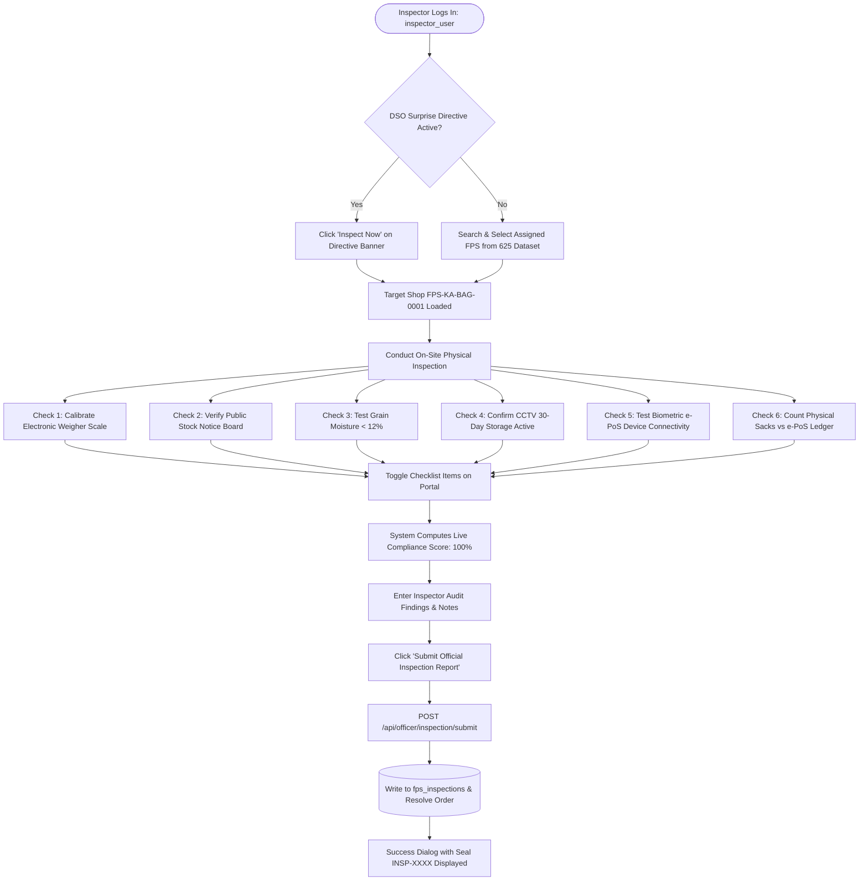

# PDS DemandSync — Field Food Inspector Operations Manual
**On-Site Verification, Legal Metrology Audit, Digital Inspection Checklist & Regulatory Compliance**  
*Department of Food, Civil Supplies & Consumer Affairs • Field Enforcement Wing (SIH 2026 Reference)*

---

## 1. Executive Role Definition & Statutory Authority

The **Field Food Inspector** acts as the frontline regulatory enforcement officer under the **Essential Commodities Act, 1955**, the **Legal Metrology Act, 2009**, and the **Karnataka Essential Commodities (Public Distribution System) Control Order**. 

The Inspector exercises direct supervisory powers to:
1. **Execute Surprise Audit Directives**: Receive and execute unannounced inspection orders dispatched in real-time by the District Supply Officer (DSO).
2. **Inspect Physical Ration Shops**: Perform on-site audits across assigned Fair Price Shops in the district.
3. **Verify Legal Metrology & Weighing Scales**: Verify that point-of-sale electronic weighing balances are stamped, certified, and calibrated within statutory $\pm 0.05\%$ accuracy limits to prevent short-weighing.
4. **Inspect Grain Quality & Moisture Standards**: Validate that Fortified Rice and Wheat conform to Fair Average Quality (FAQ) standards with grain moisture $< 12\%$ and no pest infestation.
5. **Enforce CCTV & Transparency Mandates**: Inspect shopfront public stock boards and 30-day CCTV video retention archives.
6. **Submit Digital Audit Certificates**: File tamper-evident digital inspection reports (`INSP-XXXX`) that permanently record compliance scores and remarks on the central state database.

---

## 2. Authentication & System Gateway

| Parameter | Operational Specification |
| :--- | :--- |
| **Portal URL** | `https://sih-final-production-d29c.up.railway.app/app/` |
| **Access Gateway** | Select Tab **"Department Official"** $\to$ Choose Role **"Field Food Inspector"** |
| **Officer User ID** | `inspector_user` |
| **Officer Password** | `inspector_pass` |
| **System Role Code** | `FIELD_FOOD_INSPECTOR` |
| **Frontend Implementation** | [`field_food_inspector_dashboard_screen.dart`](file:///d:/SIH%20FINAL/frontend/lib/screens/admin/field_food_inspector_dashboard_screen.dart) |
| **Backend API Route** | [`backend/app/api/officer.py`](file:///d:/SIH%20FINAL/backend/app/api/officer.py) |

---

## 3. Inspector Portal Screen Architecture

```
+-------------------------------------------------------------------------------------------------------+
|  🔍 Field Food Inspector Portal                      Officer: inspector_user • Zone: Bengaluru Urban  |
+-------------------------------------------------------------------------------------------------------+
|  ⚠️ DSO Directive: 1 Surprise Inspection Order(s) Active                                              |
|  Shop: FPS-KA-BAG-0001 • Priority: CRITICAL • Reason: Stock variance check           [ Inspect Now ]   |
+-------------------------------------------------------------------------------------------------------+
|  1. Select Assigned Ration Shop (From Master Dataset):                                                |
|  [ 🔍 Search by FPS ID or Locality (e.g. Malleshwaram, FPS-KA-BAG-0001)... ]                         |
|  • [✓] Malleshwaram Fair Price Shop #1 (FPS-KA-BAG-0001) | Cap: 25,000 kg | Stock: 1,500 kg          |
|  • [ ] Rajajinagar PDS Center          (FPS-KA-MAL-0002) | Cap: 20,000 kg | Stock: 1,200 kg          |
|  • [ ] Indiranagar Ration Depot        (FPS-KA-IND-0003) | Cap: 30,000 kg | Stock: 2,100 kg          |
+-------------------------------------------------------------------------------------------------------+
|  2. 6-Point Digital Audit Checklist:                                           [ Score: 100% ]        |
|  [ON] 1. Weigher Scale Electronic Calibration Certificate Valid (±0.05% tolerance verified)          |
|  [ON] 2. Daily Statutory Stock Board Display Updated Outside Shop (Legible price & stock lists)       |
|  [ON] 3. Sample Grain Quality Verification (Moisture < 12%, pest-free fortified rice & wheat)         |
|  [ON] 4. CCTV Security Recording Feed Active & Stored (30-day retention verified)                    |
|  [ON] 5. Biometric e-PoS Terminal Responsive & Online (4G connected, biometric reader clean)         |
|  [ON] 6. Physical Register vs e-PoS Ledger Audit Aligned (Zero unaccounted stock variance)           |
+-------------------------------------------------------------------------------------------------------+
|  3. Inspector Remarks & Audit Findings:                                                               |
|  [ All stock sacks physically verified. Machine calibration valid. No diversion detected.          ] |
+-------------------------------------------------------------------------------------------------------+
|  [ 🚀 SUBMIT OFFICIAL INSPECTION REPORT FOR FPS-KA-BAG-0001 ]                                         |
+-------------------------------------------------------------------------------------------------------+
```

### Component Breakdown

### 3.1 Active DSO Directive Alert Banner
- Flashes at the top of the screen when the District Supply Officer dispatches an unannounced inspection directive.
- Displays target **Shop ID**, **Priority** (`CRITICAL`/`HIGH`), and the **DSO's specific reason**.
- Features an **"Inspect Now"** shortcut button that instantly selects the targeted ration shop and pre-populates the order link.

### 3.2 Dynamic Assigned Ration Shop Selector
- Directly queries the central database (`/api/fps`) containing all **625 registered Fair Price Shops** in the district.
- Real-time instant filtering by shop license number (`FPS-KA-BAG-0001`) or locality name (`Malleshwaram`).
- Displays live registered warehouse capacity and current stock on hand.

### 3.3 6-Point Statutory Digital Checklist
Each item carries equal compliance weight ($16.67\%$ each, totaling $100\%$):

1. **Weigher Scale Calibration Certificate**:
   - Legal Metrology department annual seal and calibration certificate verified.
   - Scale tested with standard $10\text{ kg}$ test weights within $\pm 0.05\%$ accuracy.
2. **Daily Statutory Stock Board Display**:
   - Notice board placed at shop entrance displaying opening balances, retail issue prices, and working hours.
3. **Sample Grain Quality Verification**:
   - Visual and physical moisture meter check confirming grain moisture $< 12\%$ with zero insect infestation or foreign matter.
4. **CCTV Security Recording Feed Active**:
   - Working cameras covering the grain weighing platform and citizen queue with 30-day local storage.
5. **Biometric e-PoS Terminal Responsive & Online**:
   - POS device operational with active 4G network connection and clean optical biometric sensor.
6. **Physical Register vs e-PoS Ledger Audit**:
   - Physical bag count in storage matches electronic inventory balances in the central SQLite ledger.

### 3.4 Live Compliance Scoring Engine
- Calculates in real time: $\text{Score} = (\text{Checked Items} / 6) \times 100\%$.
- Visual color indicator:
  - **Green ($\ge 80\%$)**: Fully compliant; licensed to operate.
  - **Amber ($50\% - 79\%$)**: Minor non-compliance; 7-day rectification notice issued.
  - **Red ($< 50\%$)**: Critical non-compliance; immediate suspension recommended to DSO.

---

## 4. End-to-End Field Inspector Operational Workflows



### 4.2 Step-by-Step Walkthrough: Conducting an Unannounced Audit
1. **Receive Order**: Notice the red directive banner: *"DSO Directive: 1 Surprise Inspection Order(s) Active — Shop FPS-KA-BAG-0001"*.
2. **Accept Directive**: Click **"Inspect Now"**. The shop card for *Malleshwaram Fair Price Shop #1* is automatically highlighted.
3. **Execute Physical Checks**:
   - Place certified standard weight on the e-PoS scale $\to$ verify reading $\to$ toggle **Checklist Item 1** ON.
   - Verify outside board has today's date, opening balance, and prices $\to$ toggle **Checklist Item 2** ON.
   - Take sample from Fortified Rice sack; probe moisture meter ($11.2\%$) $\to$ toggle **Checklist Item 3** ON.
   - Inspect DVR camera unit $\to$ toggle **Checklist Item 4** ON.
   - Verify e-PoS terminal connects to server $\to$ toggle **Checklist Item 5** ON.
   - Tally 30 sacks of Fortified Rice ($1,500\text{ kg}$) with screen display $\to$ toggle **Checklist Item 6** ON.
4. **Review Score**: Observe the compliance score display **100% (Compliant)**.
5. **Input Observations**: Enter: *"Physical stock verified. Scale calibration valid. Biometric scanner functional. No diversion detected."*
6. **Submit**: Click **"Submit Official Inspection Report for FPS-KA-BAG-0001"**.
7. **Confirmation**: A confirmation dialog renders the generated inspection seal `INSP-4921`. The DSO's directive status shifts to `COMPLETED`.

---

## 5. Database State Mutation

Submitting an inspection executes an atomic database transaction:

```sql
-- 1. Insert permanent inspection record
INSERT INTO fps_inspections (
    inspection_id,
    fps_id,
    inspector_id,
    compliance_score,
    checklist_json,
    remarks,
    status,
    created_at
) VALUES (
    'INSP-4921',
    'FPS-KA-BAG-0001',
    'inspector_user',
    100.0,
    '{"scale_calibrated": true, "stock_board": true, "grain_quality": true, "cctv_active": true, "epos_online": true, "stock_reconciled": true}',
    'Physical stock verified. Scale calibration valid. No diversion detected.',
    'COMPLIANT',
    '2026-09-16T01:25:00Z'
);

-- 2. Mark parent DSO directive as COMPLETED
UPDATE surprise_inspection_orders
SET status = 'COMPLETED',
    completed_at = '2026-09-16T01:25:00Z',
    inspection_id = 'INSP-4921'
WHERE fps_id = 'FPS-KA-BAG-0001' AND status = 'PENDING';
```

---

## 6. Technical REST API Specification

### 6.1 Submit Inspection Report
- **Endpoint**: `POST /api/officer/inspection/submit`
- **Headers**: `Content-Type: application/json`
- **Request Body**:
```json
{
  "fps_id": "FPS-KA-BAG-0001",
  "inspector_id": "inspector_user",
  "compliance_score": 100.0,
  "checklist": {
    "scale_calibrated": true,
    "stock_board_displayed": true,
    "grain_quality_verified": true,
    "cctv_active": true,
    "epos_terminal_online": true,
    "stock_reconciled": true
  },
  "remarks": "Physical stock verified. Scale calibration valid. No diversion detected."
}
```
- **Response (200 OK)**:
```json
{
  "status": "success",
  "message": "Inspection report registered and verified successfully",
  "inspection": {
    "inspection_id": "INSP-4921",
    "fps_id": "FPS-KA-BAG-0001",
    "inspector_id": "inspector_user",
    "compliance_score": 100.0,
    "status": "COMPLIANT",
    "created_at": "2026-09-16T01:25:00Z"
  }
}
```

### 6.2 Fetch Historical Inspection Records
- **Endpoint**: `GET /api/officer/inspections?fps_id=FPS-KA-BAG-0001`
- **Response (200 OK)**:
```json
[
  {
    "inspection_id": "INSP-4921",
    "fps_id": "FPS-KA-BAG-0001",
    "inspector_id": "inspector_user",
    "compliance_score": 100.0,
    "remarks": "Physical stock verified. Scale calibration valid. No diversion detected.",
    "created_at": "2026-09-16T01:25:00Z"
  }
]
```

---

## 7. SIH 2026 Jury Presentation & Live Demo Script (Inspector)

| Step | Action | What the Jury Sees | What to Say to the Jury |
| :---: | :--- | :--- | :--- |
| **1** | Select **"Department Official"** $\to$ Click **"Field Food Inspector"**. | Inspector Portal loads with the active DSO Directive banner. | *"The moment the DSO dispatched the surprise inspection order, our Field Food Inspector's tablet instantly alerted them with the specific directive and reason."* |
| **2** | Click **"Inspect Now"** on the directive banner. | Malleshwaram FPS (`FPS-KA-BAG-0001`) is highlighted. | *"No manual navigation needed; the directive binds directly to the target shop from our real 625 dataset."* |
| **3** | Toggle the **6 digital audit checklist items** one by one. | Compliance score bar increments dynamically from 0% to 100%. | *"The inspector verifies 6 legal parameters including scale calibration, grain moisture, CCTV, and e-PoS ledger balance. Each toggle calculates an objective compliance score."* |
| **4** | Enter inspection remarks and click **"Submit Official Inspection Report"**. | Success dialog displays inspection seal `INSP-XXXX`. | *"When submitted, the report writes to the database, auto-resolves the DSO's order, and logs an immutable audit trail for the State Vigilance Auditor."* |
