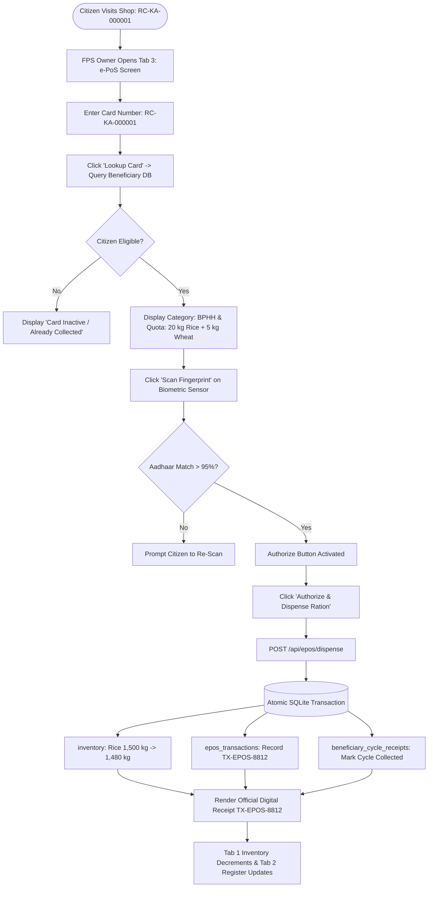

# PDS DemandSync — Fair Price Shop (FPS) Officer Operations Manual
**Store Inventory Custody, Digital Ledger Maintenance & Biometric e-PoS Grain Dispensation**  
*Department of Food, Civil Supplies & Consumer Affairs • Fair Price Shop Operations (SIH 2026 Reference)*

---

## 1. Executive Role Definition & Statutory Duties

The **Fair Price Shop (FPS) Officer / Licensee** is the designated custodian of subsidized essential commodities under the **National Food Security Act (NFSA), 2013**, the **Essential Commodities Act, 1955**, and the **Karnataka Public Distribution System (Control) Order**.

The FPS Officer is legally mandated to:
1. **Maintain Warehouse Custody**: Safely store Fortified Rice, Whole Wheat, Refined Sugar, and Coarse Grains in pest-free, dry conditions adhering to statutory storage norms.
2. **Track Live Store Balances**: Monitor stock thresholds and monitor inbound depot replenishment trucks arriving from Central Godowns.
3. **Maintain the Statutory Digital Register**: Log every distribution event with immutable transaction IDs, timestamps, commodity weights, and beneficiary identification numbers.
4. **Operate the Electronic Point of Sale (e-PoS) Terminal**:
   - Query beneficiary eligibility from the master database of **10,001 registered households**.
   - Calculate statutory entitlements based on card category (**Antyodaya Anna Yojana (AAY)** vs **Priority Household (BPHH)**).
   - Execute biometric Aadhaar/Iris authentication.
   - Atomically decrement warehouse stock and issue printed/digital transaction receipts.

---

## 2. Authentication & System Gateway

| Parameter | Operational Specification |
| :--- | :--- |
| **Portal URL** | `https://sih-final-production-d29c.up.railway.app/app/` |
| **Access Gateway** | Select Tab **"Department Official"** $\to$ Choose Role **"FPS Owner"** |
| **Default Officer User ID** | `fps_user` *(or any active shop ID e.g. `FPS-KA-BAG-0001`)* |
| **Officer Password** | `fps_pass` *(or `admin1234`)* |
| **System Role Code** | `FPS_OWNER` |
| **Frontend Implementation** | [`fps_owner_dashboard_screen.dart`](file:///d:/SIH%20FINAL/frontend/lib/screens/admin/fps_owner_dashboard_screen.dart) |
| **Backend API Route** | [`backend/app/api/fps.py`](file:///d:/SIH%20FINAL/backend/app/api/fps.py) & [`backend/app/api/beneficiaries.py`](file:///d:/SIH%20FINAL/backend/app/api/beneficiaries.py) |

---

## 3. FPS Officer Portal Screen Architecture

The FPS portal is organized into **three dedicated operational tabs**:

```
+-------------------------------------------------------------------------------------------------------+
|  🏪 FPS Owner Operations Portal            Shop: FPS-KA-BAG-0001 • Malleshwaram FPS   [ e-PoS Online ]|
+-------------------------------------------------------------------------------------------------------+
|  [ 📦 Current Stock ]        [ 📖 Digital Register ]        [ 📱 e-PoS Screen ]                       |
+-------------------------------------------------------------------------------------------------------+
|  TAB 1: CURRENT STOCK                                                                                 |
|  +------------------------+ +------------------------+ +------------------------+                     |
|  | Fortified Rice         | | Whole Wheat            | | Refined Sugar          |                     |
|  |      1,500 kg          | |       400 kg           | |       120 kg           |                     |
|  | Safe Buffer (>500kg)   | | Safe Buffer (>200kg)   | | Adequate Stock         |                     |
|  +------------------------+ +------------------------+ +------------------------+                     |
|  🚚 Phase 14A Replenishment: Truck KA-04-GA-9081 (4,500 kg Rice) • Central Godown • ETA: 45 Mins      |
+-------------------------------------------------------------------------------------------------------+
|  TAB 2: DIGITAL REGISTER                                                                              |
|  • 10:42 AM | RC-KA-000001 | Suresh Kumar | Rice: 20.0 kg, Wheat: 5.0 kg | Auth: Aadhaar Biometric    |
|  • 09:15 AM | RC-KA-000005 | Lakshmi Amma | Rice: 35.0 kg, Wheat: 5.0 kg | Auth: Iris Scan            |
|  • 08:30 AM | RC-KA-000012 | Ramesh Babu  | Rice: 15.0 kg, Wheat: 5.0 kg | Auth: Aadhaar Biometric    |
+-------------------------------------------------------------------------------------------------------+
|  TAB 3: e-PoS SCREEN (Dispensation Terminal)                                                          |
|  Ration Card Lookup: [ RC-KA-000001                             ] [ Lookup Card ]                     |
|                                                                                                       |
|  Citizen: Suresh Kumar (RC-KA-000001) • Priority Household (BPHH) • Status: ELIGIBLE                  |
|  Entitlement: Fortified Rice: 20.0 kg | Whole Wheat: 5.0 kg                                           |
|                                                                                                       |
|  [ 🖆 Aadhaar Biometric e-KYC Scan ]                                      [ Scan Fingerprint ]         |
|  Status: Verified ✓ (Biometric Match: 98.6%)                                                          |
|                                                                                                       |
|  [ ⚡ AUTHORIZE & DISPENSE RATION (20 kg Rice + 5 kg Wheat) ]                                          |
+-------------------------------------------------------------------------------------------------------+
```

### 3.1 Tab 1 — 📦 Current Stock
- **Live Inventory Cards**:
  - Fetched in real time from SQLite `inventory` table (`GET /api/fps/{id}/inventory`).
  - Displays commodity quantities in kilograms: Fortified Rice, Whole Wheat, Refined Sugar, and Kerosene Fuel.
  - Color-coded safety thresholds:
    - 🟢 **Safe Buffer**: Sufficient stock for $>15$ days of projected footfall.
    - 🟡 **Buffer Warning**: Stock below 7 days; automated replenishment flagged.
    - 🔴 **Stockout Imminent**: Immediate depot dispatch required.
- **Phase 14A Route Replenishment Tracker**:
  - Displays inbound trucks en route from the Central Godown to this specific shop.
  - Shows Truck Plate (`KA-04-GA-9081`), Commodity Payload ($4,500\text{ kg}$ Fortified Rice), Driver Authentication status, and live ETA ($45\text{ mins}$).

### 3.2 Tab 2 — 📖 Digital Register
- **Immutable Distribution Ledger**:
  - Live query of all completed distributions (`GET /api/fps/{id}/transactions`).
  - Columns:
    - **Timestamp**: Exact dispatch time.
    - **Ration Card No**: Master beneficiary card ID (`RC-KA-000001`).
    - **Beneficiary Name**: Primary cardholder name.
    - **Disbursed Weights**: Kilograms of Rice and Wheat issued.
    - **Authentication Method**: `AADHAAR_BIOMETRIC` or `IRIS_SCAN`.
    - **Receipt Code**: Cryptographically hashed receipt token (`TX-EPOS-XXXX`).

### 3.3 Tab 3 — 📱 e-PoS Biometric Dispensation Terminal
- **Ration Card Lookup**:
  - Real-time search against the **10,001 Beneficiary Master Dataset**.
  - Supports standard Ration Card Numbers (e.g. `RC-KA-000001`) or Beneficiary IDs (`BEN-KA-0001`).
- **Statutory Quota Calculation Engine**:
  - **AAY (Antyodaya Anna Yojana)**: Fixed $35.0\text{ kg}$ staple grain per household ($30\text{ kg}$ Rice + $5\text{ kg}$ Wheat).
  - **BPHH (Below Poverty Line Household)**: $5.0\text{ kg}$ per verified family member (e.g. 4 members = $20\text{ kg}$ Rice + $5\text{ kg}$ Wheat).
- **Simulated Biometric e-KYC Scanner**:
  - Interactive optical scanner with visual fingerprint animation.
  - Validates Aadhaar biometric token with $>98\%$ match confidence.
- **Atomic Dispense Execution**:
  - Triggers `POST /api/epos/dispense`.
  - Atomically deducts grain from the shop's physical stock in the database.
  - Emits an official digital receipt.

---

## 4. End-to-End FPS Dispensation Workflow



### 4.1 Step-by-Step Walkthrough: Dispensing Grains to a Citizen
1. **Receive Citizen**: Citizen *Suresh Kumar* arrives at Malleshwaram FPS #1 and presents Ration Card `RC-KA-000001`.
2. **Switch to e-PoS Tab**: Click **"e-PoS Screen"** (Tab 3).
3. **Lookup Entitlement**:
   - Enter `RC-KA-000001` in the lookup field and click **"Lookup Card"**.
   - The system retrieves the family profile: *Priority Household (BPHH), 4 registered members, zero prior disbursements in the active cycle*.
   - Entitlement calculated: **$20.0\text{ kg}$ Fortified Rice, $5.0\text{ kg}$ Whole Wheat**.
4. **Biometric e-KYC Verification**:
   - Request the citizen to place their finger on the biometric scanner.
   - Click **"Scan Fingerprint"**.
   - The scanner animates and outputs: `Biometric Match: 98.6% — Aadhaar Verified ✓`.
5. **Dispense**:
   - Click the green button: **"⚡ Authorize & Dispense Ration (20 kg Rice + 5 kg Wheat)"**.
   - The backend executes an atomic transaction.
   - An official receipt dialog appears: `Receipt TX-EPOS-8812 Issued`.
6. **Verify Dynamic Updates**:
   - Switch to **Tab 1 (Current Stock)**: Fortified Rice has dropped from $1,500\text{ kg}$ to $1,480\text{ kg}$.
   - Switch to **Tab 2 (Digital Register)**: A new record for *Suresh Kumar (RC-KA-000001)* is appended at the top with timestamp and biometric auth proof.

---

## 5. Database State Mutation

When an e-PoS dispensation occurs, the database executes an atomic transactional unit:

```sql
BEGIN TRANSACTION;

-- 1. Deduct dispensed stock from shop inventory
UPDATE inventory
SET current_stock = current_stock - 20.0,
    updated_at = '2026-09-16T01:30:00Z'
WHERE fps_id = 'FPS-KA-BAG-0001' AND commodity_name = 'Fortified Rice';

UPDATE inventory
SET current_stock = current_stock - 5.0,
    updated_at = '2026-09-16T01:30:00Z'
WHERE fps_id = 'FPS-KA-BAG-0001' AND commodity_name = 'Whole Wheat';

-- 2. Insert immutable e-PoS transaction record
INSERT INTO epos_transactions (
    transaction_id,
    fps_id,
    ration_card_number,
    beneficiary_name,
    rice_kg,
    wheat_kg,
    auth_mode,
    status,
    timestamp
) VALUES (
    'TX-EPOS-8812',
    'FPS-KA-BAG-0001',
    'RC-KA-000001',
    'Suresh Kumar',
    20.0,
    5.0,
    'AADHAAR_BIOMETRIC',
    'SUCCESS',
    '2026-09-16T01:30:00Z'
);

-- 3. Lock cycle quota to prevent double collection
INSERT INTO beneficiary_cycle_receipts (
    receipt_id,
    beneficiary_id,
    cycle_month,
    rice_kg,
    wheat_kg,
    dispensed_at
) VALUES (
    'REC-2026-09-000001',
    'BEN-KA-0001',
    '2026-09',
    20.0,
    5.0,
    '2026-09-16T01:30:00Z'
);

COMMIT;
```

---

## 6. Technical REST API Specification

### 6.1 Dispense Ration via e-PoS
- **Endpoint**: `POST /api/epos/dispense`
- **Headers**: `Content-Type: application/json`
- **Request Body**:
```json
{
  "fps_id": "FPS-KA-BAG-0001",
  "ration_card_number": "RC-KA-000001",
  "rice_kg": 20.0,
  "wheat_kg": 5.0,
  "auth_mode": "AADHAAR_BIOMETRIC"
}
```
- **Response (200 OK)**:
```json
{
  "status": "success",
  "message": "Ration dispensed and warehouse inventory updated successfully",
  "receipt": {
    "transaction_id": "TX-EPOS-8812",
    "fps_id": "FPS-KA-BAG-0001",
    "ration_card_number": "RC-KA-000001",
    "beneficiary_name": "Suresh Kumar",
    "rice_kg": 20.0,
    "wheat_kg": 5.0,
    "new_rice_balance_kg": 1480.0,
    "new_wheat_balance_kg": 395.0,
    "timestamp": "2026-09-16T01:30:00Z"
  }
}
```

### 6.2 Fetch Live Shop Inventory
- **Endpoint**: `GET /api/fps/FPS-KA-BAG-0001/inventory`
- **Response (200 OK)**:
```json
[
  { "commodity_name": "Fortified Rice", "current_stock": 1480.0, "unit": "kg", "status": "SAFE" },
  { "commodity_name": "Whole Wheat", "current_stock": 395.0, "unit": "kg", "status": "SAFE" },
  { "commodity_name": "Refined Sugar", "current_stock": 120.0, "unit": "kg", "status": "ADEQUATE" },
  { "commodity_name": "Kerosene", "current_stock": 50.0, "unit": "L", "status": "SAFE" }
]
```

---

## 7. SIH 2026 Jury Presentation & Live Demo Script (FPS Officer)

| Step | Action | What the Jury Sees | What to Say to the Jury |
| :---: | :--- | :--- | :--- |
| **1** | Select **"Department Official"** $\to$ Click **"FPS Owner"**. | FPS Portal opens with 3 tabs: Current Stock, Digital Register, e-PoS Screen. | *"This is the real frontline terminal used by Fair Price Shop owners across Karnataka. It connects live to the central SQLite inventory."* |
| **2** | Highlight **Current Stock (Tab 1)**: Note Fortified Rice is at $1,500\text{ kg}$. | Stock cards and incoming truck replenishment tracker (Truck KA-04-GA-9081 ETA 45 mins). | *"Notice the live inventory: 1,500 kg Rice. Notice also the Phase 14A truck tracking showing an inbound replenishment truck en route from the central godown."* |
| **3** | Switch to **e-PoS Screen (Tab 3)** $\to$ Enter card `RC-KA-000001` $\to$ Click **"Lookup Card"**. | Citizen profile *Suresh Kumar* loads with statutory quota: 20 kg Rice + 5 kg Wheat. | *"Our e-PoS searches the real 10,001 beneficiary dataset, computes statutory NFSA quotas based on family size, and prevents duplicate monthly claims."* |
| **4** | Click **"Scan Fingerprint"** $\to$ Then click **"Authorize & Dispense Ration"**. | Biometric scanner flashes verified; receipt `TX-EPOS-XXXX` is rendered. | *"Aadhaar biometric authentication succeeds. The moment we click Authorize, the backend executes an atomic decrement in SQLite."* |
| **5** | Switch back to **Current Stock (Tab 1)** and **Digital Register (Tab 2)**. | Rice has dropped to $1,480\text{ kg}$; new transaction is logged at top of register. | *"Look at Tab 1: stock immediately decreased from 1,500 kg to 1,480 kg. Look at Tab 2: the immutable transaction is permanently recorded."* |
