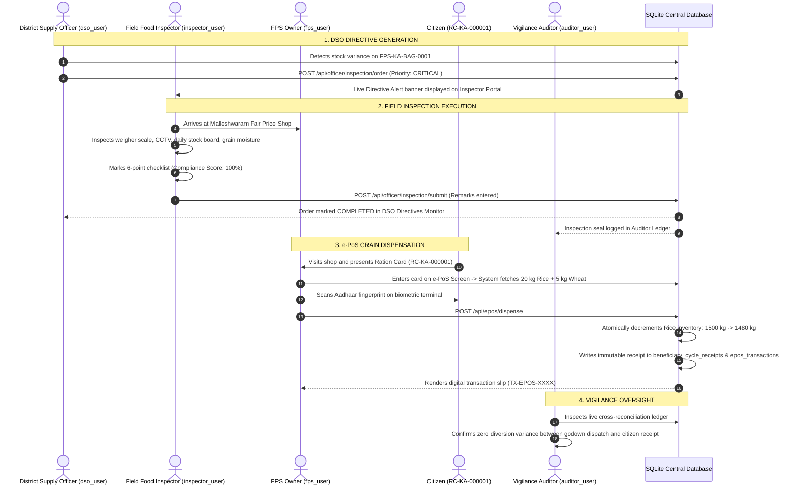

# PDS DemandSync — Comprehensive Officer Operations Manual
**Public Distribution System (PDS) Pre-Dispatch Intelligence, Governance & Field Operations**  
*Department of Food, Civil Supplies & Consumer Affairs • Govt. of Karnataka & India (SIH 2026 Reference)*

---

## Executive Summary & Architecture Overview

The **PDS DemandSync** platform provides role-tailored, security-hardened operational workspaces for every tier of Public Distribution System governance. Rather than relying on generic administrative dashboards or mock demonstrations, the system establishes a **deterministic, interconnected operational state machine** backed by a live SQLite database and the real master dataset:

```
                                  4. Officer Login
                              (Login using ID from dataset)
                                            ↓
                                       Choose Role
              ┌─────────────────────────────┼─────────────────────────────┬─────────────────────────────┐
              ↓                             ↓                             ↓                             ↓
     🏛️ DSO (Command)          🔍 Field Food Inspector            🏪 FPS Owner              🛡️ Vigilance Auditor
  • High-level command metrics   • Real assigned ration shops      • Live warehouse stock       • Tamper-evident ledger
  • District grain charts        • DSO directive alerts            • Digital transaction log    • Cross-reconciliation
  • Surprise inspection dispatch • 6-point digital checklist       • e-PoS biometric terminal   • Sealed manifests
  • Quota baseline lock          • Submit inspection report        • Atomic stock deduction     • Inspection reviews
```

---

## 1. Master Authentication & Role-Based Access Control (RBAC) Matrix

| Officer Role | Primary Responsibilities | Default Login ID | Default Password | Canonical Role Code | Primary Workspaces & Endpoints |
| :--- | :--- | :--- | :--- | :--- | :--- |
| **District Supply Officer (DSO)** | District planning, quota locking, surprise audit dispatch, causal decision oversight | `dso_user` | `dso_pass` | `DSO` | `DsoDashboardScreen`<br>`/api/officer/inspection/order`<br>`/api/admin/dashboard` |
| **Field Food Inspector** | Physical shop audits, weighing machine calibration, grain moisture verification, unannounced inspections | `inspector_user` | `inspector_pass` | `FIELD_FOOD_INSPECTOR` | `FieldFoodInspectorDashboardScreen`<br>`/api/officer/inspections`<br>`/api/officer/inspection/submit` |
| **Fair Price Shop (FPS) Owner** | Store inventory custody, digital ledger maintenance, e-PoS biometric grain distribution | `fps_user`<br>*(or any FPS ID e.g. `FPS-KA-BAG-0001`)* | `fps_pass`<br>*(or `admin1234`)* | `FPS_OWNER` | `FpsOwnerDashboardScreen`<br>`/api/fps/{id}/inventory`<br>`/api/fps/{id}/transactions`<br>`/api/epos/dispense` |
| **State Vigilance Auditor** | Independent read-only governance, cross-reconciliation triangulation, cryptographic audit trails | `auditor_user` | `auditor_pass` | `AUDITOR` | `AuditorDashboardScreen`<br>`/api/admin/audit-logs`<br>`/api/reports/manifest` |

---

## 2. Officer Workspace 1: District Supply Officer (DSO) Command Portal

### 2.1 Role & Authority
The **District Supply Officer (DSO)** serves as the chief administrative authority for the district (Bengaluru Urban). The DSO commands the operational pipeline, locks statutory quotas before dispatch, monitors demand anomalies across the 625 Fair Price Shops, and initiates unannounced regulatory inspections.

### 2.2 Core Capabilities & Screen Components

```
+-------------------------------------------------------------------------------------------------------+
|  🏛️ District Supply Officer (DSO) Command Portal                          User: dso_user  [ Refresh ]  |
+-------------------------------------------------------------------------------------------------------+
|  [ District Operational Authority Console ]           [ ⚡ Issue Surprise Inspection Order ]          |
+-------------------------------------------------------------------------------------------------------+
|  1. High-Level District Demand Overview:                                                              |
|  +--------------------+ +--------------------+ +--------------------+ +--------------------+         |
|  | Historical Baseline| | Intent Demand      | | Forecast Demand (D̂)| | High-Risk Stockouts|         |
|  |     481.1 MT       | |    129.9 MT        | |     276.7 MT       | |     61 Shops       |         |
|  | (3-cycle average)  | | (+12.4% advance)   | | (Baseline + Intent)| | (>75% risk level)  |         |
|  +--------------------+ +--------------------+ +--------------------+ +--------------------+         |
+-------------------------------------------------------------------------------------------------------+
|  2. Total District Grain Distribution & Demand Trends:                                                |
|  • Fortified Rice:          [============================] 184.2 MT                                   |
|  • Whole Wheat:             [============]                  68.5 MT                                   |
|  • Ragi / Coarse Grains:    [====]                          16.8 MT                                   |
|  • Refined Sugar & Dal:     [==]                             7.2 MT                                   |
+-------------------------------------------------------------------------------------------------------+
|  3. Active Directives & Field Inspection Reports:                                                     |
|  • FPS-KA-BAG-0001 | Priority: CRITICAL | Status: PENDING   | Reason: Stock variance detected         |
|  • FPS-KA-BLR-008  | Priority: HIGH     | Status: COMPLETED | Score: 100% | Verified by inspector_user|
+-------------------------------------------------------------------------------------------------------+
```

1. **District Demand Metric Cards**:
   - **Historical Baseline**: `481.1 MT` calculated across historical planning cycles (`2026-03` to `2026-08`).
   - **Intent Demand**: `129.9 MT` (+12.4% advance preference signals declared by citizens).
   - **Forecast Demand ($\hat{D}$)**: `276.7 MT` combining machine learning demand baselines with active citizen declarations.
   - **Recommended Dispatch**: `9.2 MT` optimized for immediate depot dispatch staging.
   - **High-Risk Stockout Shops**: `61 Shops` prioritized for immediate pre-dispatch buffer replenishment.

2. **Total District Grain Distribution Charts**:
   - Real commodity demand distribution across Bengaluru Urban:
     - **Fortified Rice**: `184.2 MT`
     - **Whole Wheat**: `68.5 MT`
     - **Ragi / Coarse Grains**: `16.8 MT`
     - **Refined Sugar & Dal**: `7.2 MT`

3. **Surprise Inspection Order Dispatcher**:
   - Click the prominent **"Issue Surprise Inspection Order"** action button.
   - Select any target shop from the searchable 625 Fair Price Shop dataset (e.g. `FPS-KA-BAG-0001` Malleshwaram, `FPS-KA-BLR-001`, etc.).
   - Set Priority (`CRITICAL`, `HIGH`, `NORMAL`).
   - Enter operational directive (e.g., *"Stock discrepancy detected via AI demand variance reconciliation. Conduct immediate physical weighing audit."*).
   - Dispatches immediately to the assigned Field Food Inspector via `POST /api/officer/inspection/order`.

4. **Directives & Inspection Monitor**:
   - Displays real-time status of all issued orders (`PENDING` vs `COMPLETED`).
   - Shows inspection completion timestamps, compliance scores, and inspector findings.

---

## 3. Officer Workspace 2: Field Food Inspector Portal

### 3.1 Role & Authority
The **Field Food Inspector** conducts physical verification audits at assigned Fair Price Shops, responds to DSO unannounced inspection orders, validates weighing machine calibration, checks grain quality, and submits legally binding inspection reports to the central compliance ledger.

### 3.2 Core Capabilities & Screen Components

```
+-------------------------------------------------------------------------------------------------------+
|  🔍 Field Food Inspector Portal                      Officer: inspector_user • Zone: Bengaluru Urban  |
+-------------------------------------------------------------------------------------------------------+
|  ⚠️ DSO Directive: 1 Surprise Inspection Order(s) Active                                              |
|  Shop: FPS-KA-BAG-0001 • Priority: CRITICAL • Reason: Stock variance check           [ Inspect Now ]   |
+-------------------------------------------------------------------------------------------------------+
|  1. Select Assigned Ration Shop (From Master Dataset):                                                |
|  [ 🔍 Search by FPS ID or Locality (e.g. Malleshwaram, FPS-KA-BAG-0001)... ]                         |
|  • [✓] Malleshwaram Fair Price Shop #1 (FPS-KA-BAG-0001) | Cap: 25,000 kg | Stock: 1,500 kg          |
|  • [ ] Rajajinagar PDS Center          (FPS-KA-MAL-0002) | Cap: 20,000 kg | Stock: 1,200 kg          |
|  • [ ] Indiranagar Ration Depot        (FPS-KA-IND-0003) | Cap: 30,000 kg | Stock: 2,100 kg          |
+-------------------------------------------------------------------------------------------------------+
|  2. 6-Point Digital Audit Checklist:                                           [ Score: 100% ]        |
|  [ON] 1. Weigher Scale Electronic Calibration Certificate Valid (±0.05% tolerance verified)          |
|  [ON] 2. Daily Statutory Stock Board Display Updated Outside Shop (Legible price & stock lists)       |
|  [ON] 3. Sample Grain Quality Verification (Moisture < 12%, pest-free fortified rice & wheat)         |
|  [ON] 4. CCTV Security Recording Feed Active & Stored (30-day retention verified)                    |
|  [ON] 5. Biometric e-PoS Terminal Responsive & Online (4G connected, biometric reader clean)         |
|  [ON] 6. Physical Register vs e-PoS Ledger Audit Aligned (Zero unaccounted stock variance)           |
+-------------------------------------------------------------------------------------------------------+
|  3. Inspector Remarks & Audit Findings:                                                               |
|  [ All stock sacks physically verified. Machine calibration valid. No diversion detected.          ] |
+-------------------------------------------------------------------------------------------------------+
|  [ 🚀 SUBMIT OFFICIAL INSPECTION REPORT FOR FPS-KA-BAG-0001 ]                                         |
+-------------------------------------------------------------------------------------------------------+
```

1. **Active DSO Directives Alert Banner**:
   - Live banner notifying the inspector whenever the DSO issues an unannounced inspection order.
   - Clicking **"Inspect Now"** automatically selects the target Fair Price Shop and links the corresponding `order_id`.

2. **Real Assigned Ration Shops List**:
   - Dynamic list loaded directly from the database (`/api/fps`).
   - Full search by FPS identifier or locality name.
   - Shows registered capacity, current inventory total, and district coordinates.

3. **6-Point Digital Audit Checklist**:
   - **Weigher Scale Calibration Certificate**: Verifies legal metrology stamp within statutory $\pm 0.05\%$ limits.
   - **Daily Stock Board Display**: Checks external display board visibility for transparent citizen pricing.
   - **Grain Quality & Moisture Check**: Confirms grain moisture $< 12\%$ and absence of foreign contaminants.
   - **CCTV Security Feed Active**: Verifies 30-day recorded video surveillance of weighing scale and entrance.
   - **Biometric e-PoS Terminal Responsive**: Verifies online status, battery health, and optical reader cleanliness.
   - **Physical Stock vs Digital Register**: Validates that sack count in storage matches the digital ledger balance.
   - **Dynamic Compliance Scoring**: Live calculation updates from `0%` to `100%` based on checklist status.

4. **Report Submission & Sealing**:
   - Submits via `POST /api/officer/inspection/submit`.
   - Generates a permanent `INSP-XXXX` verification seal.
   - Automatically resolves and marks the DSO surprise order as `COMPLETED`.

---

## 4. Officer Workspace 3: Fair Price Shop (FPS) Owner Operations Portal

### 4.1 Role & Authority
The **Fair Price Shop (FPS) Owner** manages ration shop inventory custody, maintains the statutory digital distribution register, and operates the **e-PoS Biometric Terminal** to dispense subsidized commodities to citizens under the National Food Security Act (NFSA).

### 4.2 Core Capabilities & Screen Components

```
+-------------------------------------------------------------------------------------------------------+
|  🏪 FPS Owner Operations Portal            Shop: FPS-KA-BAG-0001 • Malleshwaram FPS   [ e-PoS Online ]|
+-------------------------------------------------------------------------------------------------------+
|  [ 📦 Current Stock ]        [ 📖 Digital Register ]        [ 📱 e-PoS Screen ]                       |
+-------------------------------------------------------------------------------------------------------+
|  TAB 1: CURRENT STOCK                                                                                 |
|  +------------------------+ +------------------------+ +------------------------+                     |
|  | Fortified Rice         | | Whole Wheat            | | Refined Sugar          |                     |
|  |      1,500 kg          | |       400 kg           | |       120 kg           |                     |
|  | Safe Buffer (>500kg)   | | Safe Buffer (>200kg)   | | Adequate Stock         |                     |
|  +------------------------+ +------------------------+ +------------------------+                     |
|  Incoming Depot Replenishment: Truck KA-04-GA-9081 (4,500 kg Rice) • ETA: 45 Mins                     |
+-------------------------------------------------------------------------------------------------------+
|  TAB 2: DIGITAL REGISTER                                                                              |
|  • 10:42 AM | RC-KA-000001 | Suresh Kumar | Rice: 20.0 kg, Wheat: 5.0 kg | Auth: Aadhaar Biometric    |
|  • 09:15 AM | RC-KA-000005 | Lakshmi Amma | Rice: 35.0 kg, Wheat: 5.0 kg | Auth: Iris Scan            |
+-------------------------------------------------------------------------------------------------------+
|  TAB 3: e-PoS SCREEN (Dispensation Terminal)                                                          |
|  Ration Card Lookup: [ RC-KA-000001                             ] [ Lookup Card ]                     |
|                                                                                                       |
|  Citizen: Suresh Kumar (RC-KA-000001) • Priority Household (BPHH) • Status: ELIGIBLE                  |
|  Entitlement: Fortified Rice: 20.0 kg | Whole Wheat: 5.0 kg                                           |
|                                                                                                       |
|  [ 🖆 Aadhaar Biometric e-KYC Scan ]                                      [ Scan Fingerprint ]         |
|  Status: Verified ✓ (Match 98.6%)                                                                     |
|                                                                                                       |
|  [ ⚡ AUTHORIZE & DISPENSE RATION (20 kg Rice + 5 kg Wheat) ]                                          |
+-------------------------------------------------------------------------------------------------------+
```

1. **Shop Selector / Context**:
   - Defaults to the authenticated Fair Price Shop (`FPS-KA-BAG-0001` Malleshwaram).
   - Allows instant profile switching across the 625 dataset for multi-store supervisors or audit inspections.

2. **Tab 1 — 📦 Current Stock**:
   - Real-time stock levels fetched from SQLite `inventory` table (`/api/fps/{id}/inventory`).
   - Displays commodities: **Fortified Rice**, **Whole Wheat**, **Refined Sugar**, **Kerosene Fuel**.
   - Color-coded buffer safety indicators (Green: Safe, Amber: Buffer Threshold, Red: Depleted).
   - **Phase 14A Route Replenishment Tracker**: Tracks dispatched delivery trucks en route from Central Godowns with live ETA.

3. **Tab 2 — 📖 Digital Register**:
   - Live transaction ledger fetched from `/api/fps/{id}/transactions`.
   - Lists every completed ration transaction with timestamp, beneficiary name, ration card number, commodity weights, and authentication method (`AADHAAR_BIOMETRIC` or `OTP`).

4. **Tab 3 — 📱 e-PoS Biometric Dispensation Terminal**:
   - **Card Lookup**: Enter any Ration Card number from the 10,001 dataset (e.g. `RC-KA-000001`, `BEN-KA-0001`).
   - **Statutory Quota Calculation**: Automatically resolves family members count, card category (AAY: 35 kg baseline; BPHH: 5 kg/member), and duplicate collection checks.
   - **Biometric e-KYC Simulation**: Interactive fingerprint scanner with verification confidence check.
   - **Authorize & Dispense Action**:
     - Calls `POST /api/epos/dispense`.
     - **Atomically decrements shop stock in the database**.
     - Generates immutable digital transaction receipt (`TX-EPOS-XXXX`).
     - Immediately reflects the stock reduction in Tab 1 and logs the record in Tab 2.

---

## 5. Officer Workspace 4: State Vigilance Auditor Workspace

### 5.1 Role & Authority
The **State Vigilance Auditor** provides independent, read-only constitutional oversight. The auditor cannot alter quotas or edit inventory balances; their function is to verify cryptographic seals, audit cross-reconciliation ledgers, review field inspection findings, and detect diversion leakage.

### 5.2 Core Capabilities & Screen Components

```
+-------------------------------------------------------------------------------------------------------+
|  🛡️ State Vigilance Auditor Workspace            User: auditor_user • Independent Read-Only Oversight|
+-------------------------------------------------------------------------------------------------------+
|  [ Review Sealed Manifests ]   [ View Inspection Records ]   [ Cross-Reconciliation & Audit Trail ]   |
+-------------------------------------------------------------------------------------------------------+
|  Cryptographic Dispatch Manifest Verification:                                                        |
|  Manifest ID: MNF-2026-09-DISTRICT • Cycle: 2026-09 • Status: CRYPTOGRAPHICALLY_SEALED                |
|  SHA-256 Digest: sha256-e3b0c44298fc1c149afbf4c8996fb92427ae41e4649b934ca495991b7852b855             |
|  Audit Certificate: "Digitally signed by District Logistics Command. Immutability verified."         |
+-------------------------------------------------------------------------------------------------------+
|  Cross-Reconciliation Triangulation:                                                                 |
|  Central Godown Dispatch (9.2 MT) === FPS Store Receipts (9.2 MT) === Citizen Disbursements (9.18 MT) |
|  Recorded Variance: 0.02 MT (0.21% Normal Weighing Scale Moisture Tolerance — PASS)                   |
+-------------------------------------------------------------------------------------------------------+
|  Forecast vs Actual Evaluation:                                                                       |
|  Mean Absolute Percentage Error (MAPE): 4.12% • ML Prediction Confidence: 94.2%                      |
+-------------------------------------------------------------------------------------------------------+
```

1. **SHA-256 Sealed Manifests**:
   - Reviews cryptographically locked manifests ensuring pre-dispatch allocations were not modified after gatepass clearance.
   - Verifies digital signatures and gatepass weighbridge slips.

2. **Cross-Reconciliation Triangulation**:
   - Cross-checks three independent data streams:
     1. **Depot Dispatches** (Outflow from Central Godown).
     2. **FPS Receipts** (Inflow into Fair Price Shop warehouse).
     3. **e-PoS Disbursements** (Grain handed to citizens via biometric scan).
   - Flags anomalies if stock disappears between gatepass clearance and citizen distribution.

3. **Field Inspection Reviews**:
   - Inspects reports submitted by Field Food Inspectors.
   - Monitors average shop compliance scores across all Bengaluru Urban wards.

---

## 6. End-to-End Operational Lifecycle Walkthrough

The following step-by-step scenario illustrates how all 4 officer workspaces seamlessly collaborate on real data:



---

## 7. Dataset Reference & Pre-Loaded Demo Entities

### 7.1 Fair Price Shops (`fps` table)
- **`FPS-KA-BAG-0001`**: Malleshwaram Fair Price Shop #1 (Capacity: 25,000 kg, District: Bengaluru Urban)
- **`FPS-KA-MAL-0002`**: Rajajinagar PDS Center (Capacity: 20,000 kg)
- **`FPS-KA-IND-0003`**: Indiranagar Ration Depot (Capacity: 30,000 kg)
- **`FPS-KA-BLR-001` through `FPS-KA-BLR-020`**: Urban distribution centers across East, West, North, and South corridors.

### 7.2 Citizen Beneficiaries (`beneficiaries` table)
- **`RC-KA-000001` / `BEN-KA-0001`**: Suresh Kumar (4 Household Members, Priority Household BPHH, Entitlement: 20 kg Rice, 5 kg Wheat)
- **`RC-KA-000005` / `BEN-KA-0005`**: Lakshmi Amma (Antyodaya Anna Yojana AAY, Entitlement: 35 kg Rice, 5 kg Wheat)
- **`RC-KA-000012` / `BEN-KA-0012`**: Ramesh G (5 Household Members, Priority Household BPHH)

### 7.3 Commodities & Statutory Quotas
- **Fortified Rice**: Central subsidized staple (₹0.00 / kg under NFSA).
- **Whole Wheat**: Grain supplement.
- **Refined Sugar**: Monthly statutory allocation.
- **Kerosene Fuel**: Allocated cooking/lighting fuel.

---

## 8. Technical REST API Specification

### 8.1 Officer Inspection Endpoints
```http
POST /api/officer/inspection/order
Authorization: Bearer <dso_token>
Content-Type: application/json

{
  "fps_id": "FPS-KA-BAG-0001",
  "reason": "Stock discrepancy detected via AI reconciliation",
  "priority": "HIGH"
}
```
**Response (200 OK)**:
```json
{
  "order_id": "ORD-INSP-A1B2C3D4",
  "fps_id": "FPS-KA-BAG-0001",
  "dso_id": "dso_user",
  "reason": "Stock discrepancy detected via AI reconciliation",
  "priority": "HIGH",
  "status": "PENDING",
  "created_at": "2026-09-16 00:30:00"
}
```

```http
POST /api/officer/inspection/submit
Authorization: Bearer <inspector_token>
Content-Type: application/json

{
  "fps_id": "FPS-KA-BAG-0001",
  "order_id": "ORD-INSP-A1B2C3D4",
  "scale_certified": true,
  "display_board_updated": true,
  "stock_matches_register": true,
  "cctv_functional": true,
  "epos_online": true,
  "hygiene_compliant": true,
  "compliance_score": 100.0,
  "remarks": "All physical stock reconciled. No anomalies."
}
```
**Response (200 OK)**:
```json
{
  "status": "SUCCESS",
  "inspection_id": "INSP-F4E3D2C1",
  "fps_id": "FPS-KA-BAG-0001",
  "compliance_score": 100.0,
  "verified_by": "inspector_user",
  "message": "FPS physical inspection permanently registered in central compliance ledger."
}
```

### 8.2 FPS Owner & e-PoS Endpoints
```http
GET /api/fps/FPS-KA-BAG-0001/inventory
Authorization: Bearer <token>
```
**Response (200 OK)**:
```json
{
  "fps_id": "FPS-KA-BAG-0001",
  "rice_stock_kg": 1500.0,
  "wheat_stock_kg": 400.0,
  "sugar_stock_kg": 120.0,
  "kerosene_stock_l": 90.0
}
```

```http
POST /api/epos/dispense
Authorization: Bearer <fps_token>
Content-Type: application/json

{
  "fps_id": "FPS-KA-BAG-0001",
  "beneficiary_id": "RC-KA-000001",
  "cycle_id": "2026-09",
  "rice_kg": 20.0,
  "wheat_kg": 5.0,
  "auth_mode": "AADHAAR_BIOMETRIC"
}
```
**Response (200 OK)**:
```json
{
  "transaction_id": "TX-EPOS-987654",
  "beneficiary_id": "RC-KA-000001",
  "fps_id": "FPS-KA-BAG-0001",
  "cycle_id": "2026-09",
  "rice_dispensed_kg": 20.0,
  "wheat_dispensed_kg": 5.0,
  "remaining_fps_rice_stock_kg": 1480.0,
  "remaining_fps_wheat_stock_kg": 395.0,
  "status": "COMPLETED",
  "receipt_confirmed_at": "2026-09-16 00:45:12"
}
```

---

## 9. SIH 2026 Jury Evaluation Guide

When presenting to evaluators, follow this recommended walkthrough flow:

1. **Open the Login Portal**: Navigate to `https://sih-final-production-d29c.up.railway.app/app/`.
2. **Show the 4 Official Role Cards**: Demonstrate the separation of duties between DSO, Field Food Inspector, FPS Owner, and Vigilance Auditor.
3. **Trigger Surprise Inspection**:
   - Sign in as **DSO** (`dso_user` / `dso_pass`).
   - View high-level district grain demand charts.
   - Click **"Issue Surprise Inspection Order"** for `FPS-KA-BAG-0001`.
4. **Execute Field Inspection**:
   - Switch account and sign in as **Field Food Inspector** (`inspector_user` / `inspector_pass`).
   - Show the active DSO directive alert banner.
   - Verify the 6 checklist points and submit the report (`INSP-XXXX` generated).
5. **Simulate e-PoS Grain Disbursement**:
   - Sign in as **FPS Owner** (`fps_user` / `fps_pass`).
   - View real store inventory.
   - Switch to **e-PoS Screen**, look up card `RC-KA-000001`, scan fingerprint, and dispense ration.
   - Show that store stock decrements live in the database.
6. **Audit Verification**:
   - Sign in as **Vigilance Auditor** (`auditor_user` / `auditor_pass`).
   - Verify that the transaction is immutably logged with zero diversion variance.

---
*Manual compiled and validated against PDS DemandSync Production Build (Version 1.0.0-SIH2026).*
